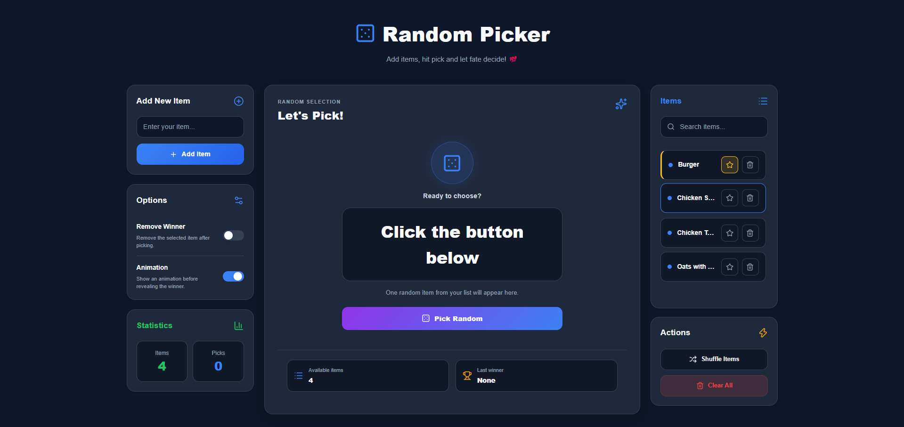

# 🎲 Random Picker PRO

A modern and responsive random item picker built with **HTML**, **CSS**, and **Vanilla JavaScript**.

Add your own items, shuffle the list, search through entries, mark favorites, and let the application randomly select a winner.

---

## 🚀 Live Demo

🔗 https://johnyisbackk.github.io/js-random-picker/

---

## ✨ Features

- ➕ Add custom items
- 🗑️ Delete individual items
- ⭐ Mark items as favorites
- 🔍 Live item search
- 🔀 Shuffle the complete list
- 🎲 Select a random winner
- ✨ Optional winner animation
- 🔁 Pick again functionality
- 🏆 Display the last winner
- 🧹 Clear all items
- 🚫 Optional automatic winner removal
- 📊 Live item and pick statistics
- 💾 LocalStorage persistence
- 📱 Fully responsive design
- 🎨 Modern dark dashboard interface

---

## 🛠️ Technologies

- HTML5
- CSS3
- Vanilla JavaScript
- LocalStorage API
- Lucide Icons

---

## 📸 Preview



---

## 📂 Project Structure

```text
random-picker-pro/
├── index.html
├── style.css
├── script.js
├── preview.png
├── README.md
└── LICENSE
```

---

## 📦 Installation

Clone the repository:

```bash
git clone https://github.com/JohnYisBackk/js-random-picker.git
```

Open the project folder and launch `index.html` in your browser.

No installation or build tools are required.

---

## 🎯 How It Works

1. Enter an item and click **Add Item**.
2. Add at least one item to the list.
3. Optionally enable winner removal or animation.
4. Click **Pick Random**.
5. The selected winner appears in the center panel.

---

## 🔮 Future Improvements

- Multiple winner selection
- Import and export lists
- Custom picker themes
- Confetti winner effect
- Weighted item probability
- Pick history
- Duplicate-item validation
- Drag-and-drop item ordering

---

## 📄 License

This project is licensed under the MIT License.

---

## ⭐ Support

If you like this project, consider giving the repository a star.
